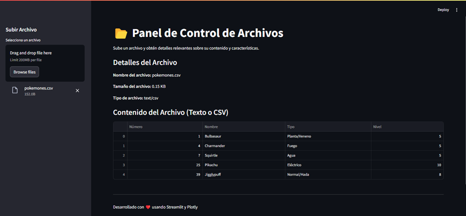

# Panel de Control de Archivos

Una aplicación interactiva desarrollada con Streamlit y Plotly para analizar y visualizar el contenido de archivos subidos por los usuarios. Este proyecto soporta los formatos de archivo más comunes, incluyendo texto, zip ,  imágenes, PDF, Word, Excel, CSV y Jupyter Notebooks.

## Características

- Visualización de contenido:
  - Archivos de texto (`.txt`, `.csv`).
  - Archivos Excel (`.xls`, `.xlsx`).
  - Archivos PDF (`.pdf`).
  - Documentos Word (`.docx`).
  - Imágenes (formatos comunes como `.png`, `.jpg`, `.jpeg`, `.bmp`, `.gif`).
  - Archivos Jupyter Notebook (`.ipynb`).
  - Archivos grandes (`zip`).
- Gráficos dinámicos:
  - Generación de gráficos interactivos (dispersión, línea, barras) para archivos Excel con columnas numéricas.

- Interfaz amigable:
  - Vista previa del contenido de los archivos.
  - Detalles básicos del archivo (nombre, tamaño, tipo).

## Tecnologías utilizadas

- Python
- Streamlit: Para la creación de la interfaz interactiva.
- Plotly: Para la generación de gráficos dinámicos.
- Pandas: Para la manipulación de datos tabulares.
- PyPDF2: Para la lectura de archivos PDF.
- python-docx: Para la lectura de documentos Word.
- Pillow: Para la visualización de imágenes.
- nbformat: Para la lectura de archivos Jupyter Notebook.
- zipfile: Para la lectura de archivos en formato zip.


## Instalación

1. Clona este repositorio:
   ```bash
   git clone https://github.com/Fishertdevs/Panel_de_Control.git
   cd Panel_de_Control


## Preview 


---
   Desarrollado por harry fishert 
